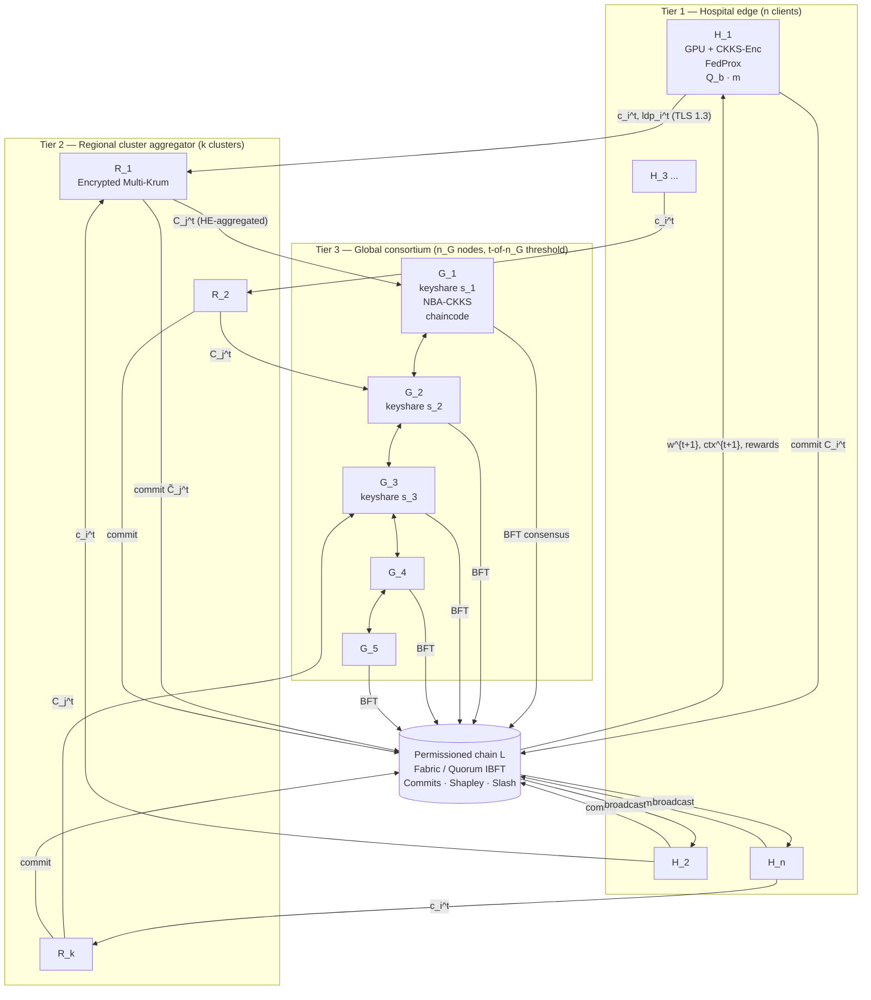
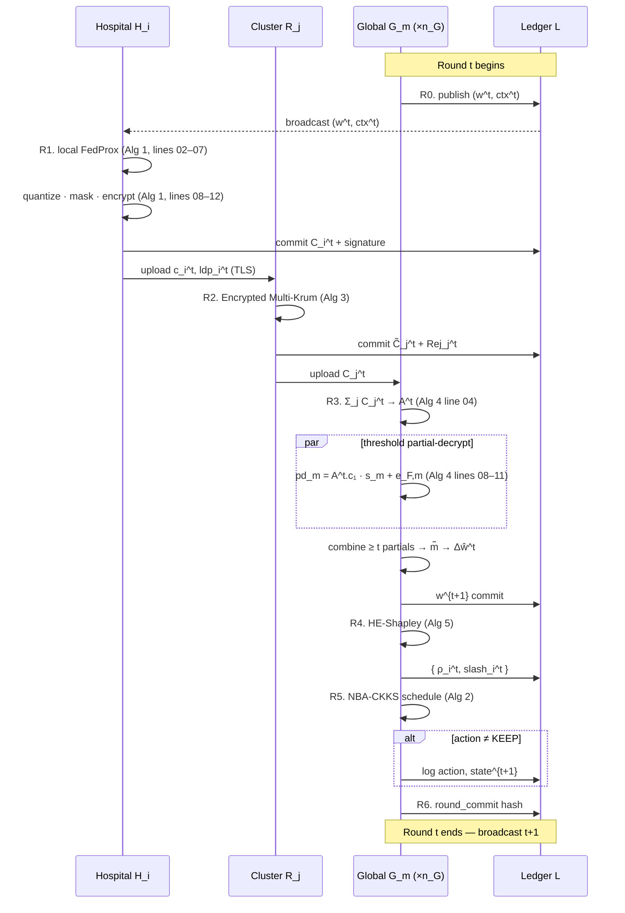
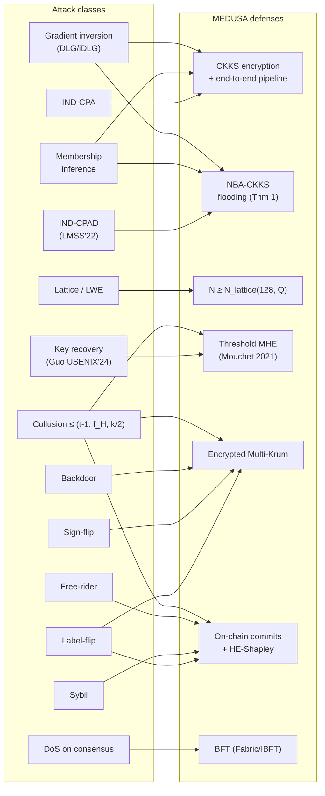

# MEDUSA — Phase 3.1 (d) — Diagrams (Mermaid drafts)
*Working drafts for D1 (architecture), D2 (sequence), D3 (NBA state machine), D4 (threat coverage). Camera-ready TikZ versions to be produced in Phase 7.*

> All diagrams render in any Mermaid-aware viewer (GitHub, VS Code Mermaid plugin, `mmdc` CLI). For the paper, redraw in TikZ.

---

## D1 — 3-tier architecture

**Notes on D1.**
- Solid arrows = data flow (TLS); double-arrows between G_m = consensus message exchange.
- Off-chain ciphertexts travel H_i → R_j → G_m via TLS; only commits hit L.
- The TSC is **not shown** because it is offline after genesis (epoch 0).

---

## D2 — One-round sequence diagram (R0–R6)

---

## D3 — NBA-CKKS scheduler state machine

```mermaid
stateDiagram-v2
  [*] --> KEEP : init at genesis

  KEEP --> KEEP : margins healthy (F1, F2, F3 all OK)
  KEEP --> EVAL : end of round (Alg 2)

  EVAL --> KEEP : all margins ≥ ε
  EVAL --> SWITCH : (F3) depth_margin < ε_depth\n& (F1,F2) OK
  EVAL --> BOOTSTRAP : (F1) prec_margin < ε_prec\n→ noise budget exhausted
  EVAL --> REKEY : (F1)+(F2) jointly tight\n→ frontier crossing imminent

  SWITCH --> KEEP : drop one prime; depth_used ← 0
  BOOTSTRAP --> KEEP : refresh noise; B_residual ← B_init\n(~30–60 s cost)
  REKEY --> KEEP : DKG round; pk' ← new pk\n(~5–20 s cost)

  KEEP --> ESCALATE : no action restores feasibility
  ESCALATE --> [*] : alarm; human in the loop
```

---

## D4 — Threat-model coverage matrix (visual)

---

## D5 — Round time budget (Gantt-style; planned, not measured yet)

```mermaid
gantt
    title One MEDUSA FL round (target wall-clock)
    dateFormat  X
    axisFormat  %s
    section R0 broadcast
    Publish ctx^t           :done, 0, 1
    section R1 hospitals
    Local FedProx           :h1, 1, 60
    Quantize · mask         :h2, after h1, 2
    CKKS encrypt (GPU)      :h3, after h2, 15
    Commit + upload         :h4, after h3, 3
    section R2 clusters
    Pairwise sq distances   :r1, after h4, 25
    Threshold dec distances :r2, after r1, 5
    Krum select + average   :r3, after r2, 5
    section R3 global
    Sum Σ C_j^t              :g1, after r3, 1
    Threshold partial decrypt:g2, after g1, 5
    Decode + dequantize     :g3, after g2, 1
    section R4 chaincode
    HE-Shapley sample       :s1, after g3, 50
    Mint reward / slash     :s2, after s1, 3
    section R5
    NBA-CKKS scheduler      :n1, after s2, 1
    section R6
    Round commit            :c1, after n1, 1
```

Target round wall-clock: **~3 minutes** (CPU baseline); **~45 s** with GPU CKKS (E9 ablation goal).

---

## Notes for camera-ready
- For Q1 publication, D1–D2 should be **redrawn in TikZ** with custom node shapes (chip icon for hospitals, hexagon for chain).
- D3 stays a finite-state diagram — TikZ `automata` library.
- D4 can be promoted to a **matrix table** (attack × defense × measured experiment) rather than a graph.
- D5 belongs in the Evaluation section, not the system-design section; redraw with measured numbers.
